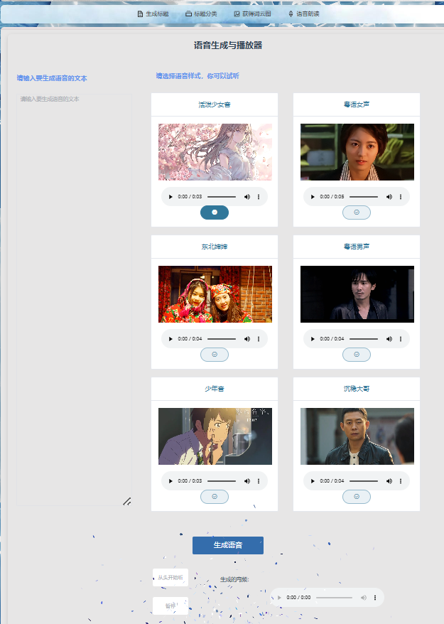

# Design report of integrated news Processing center based on large model

## 1 Program Description

### 1.1 Brief Introduction of the program

Integrated news Processing center based on large model is a user interaction system which integrates several natural language processing ( NLP ) functions. Using python + vue, the platform aims to provide users with a full range of interactive experiences through intelligent text generation, text analysis, spoken speech, and data visualization. Users can input text, and the system will automatically generate relevant titles, analyze the sentiment of the text, read the text with emotion, and generate word cloud maps for data visualization.

### 1.2 The structure of the program

Screenshots of the project functionality and implementation results are shown here.

#### 1.2.1 Main interface

On the top right of the interface, today's date and week are displayed. The main interface first introduces the news system, which is beautiful and attractive.

#### 1.2.2 Introduction to functional blinds

Through the scrolling news center function and its introduction, it can make users more convenient to understand the functions of the news system.You can tap the card to go directly to the function.

#### 1.2.3 Generating headers

By typing within 1000 words, click the generate title button to see the generated results. If you are not satisfied with the title, you can directly edit it, and you can also save the results to the history record.

#### 1.2.4 Title Classification

Input text, classify, and depending on the language model it will provide you with percentages to choose from, you can either remove categories that are not highly relevant, or classify them yourself.

#### 1.2.5 Get a word cloud map

Input text, select word cloud style, can generate hot word cloud to extract keywords.

#### 1.2.6 Speech reading

On the right side are six kinds of timbres to choose from. You can listen first, input the text you want to read aloud, click generate speech to generate audio, play and pause. You can also adjust the speaking speed to adapt to your own preferences.

#### 1.2.7 Shortcut back to the menu bar

Click the square to quickly return to the menu bar .

### 1.3 The modules of the program

#### 1.3.1 Directory tree

----news\
    |----favicon.ico
    |----index.html
    |----jsconfig.json
    |----package-lock.json
    |----package.json
    |----postcss.config.js
    |----README.md
    |----src\
    |    |----apis\
    |    |    |----origin.js
    |    |----App.vue
    |    |----assets\
    |    |    |----avatar.png
    |    |    |----base.css
    |    |    |----main.css
    |    |    |----templates\
    |    |    |    |----balloons.png
    |    |    |    |----china.png
    |    |    |    |----love.png
    |    |    |    |----pikaqiu.jpg
    |    |    |----voice\
    |    |    |    |----01.mp4
    |    |    |    |----02.mp4
    |    |    |    |----03.mp4
    |    |    |    |----04.mp4
    |    |    |    |----05.mp4
    |    |    |    |----06.mp4
    |    |----components\
    |    |    |----footer.vue
    |    |    |----header.vue
    |    |    |----icons\
    |    |    |    |----IconCommunity.vue
    |    |    |    |----IconDocumentation.vue
    |    |    |    |----IconEcosystem.vue
    |    |    |    |----IconSupport.vue
    |    |    |    |----IconTooling.vue
    |    |    |----imgList.vue
    |    |    |----nav.vue
    |    |    |----particles\
    |    |    |    |----1.js
    |    |    |----test.vue
    |    |    |----title.vue
    |    |----main.js
    |    |----pics\
    |    |    |----12.jpg
    |    |    |----13.jpg
    |    |    |----14.jpg
    |    |    |----16.png
    |    |    |----2.png
    |    |    |----23.jpg
    |    |    |----5.png
    |    |    |----voice1.jpg
    |    |    |----voice2.jpg
    |    |    |----voice3.jpg
    |    |    |----voice4.jpg
    |    |    |----voice5.jpg
    |    |    |----voice6.jpg
    |    |    |----图片1.png
    |    |    |----图片7.png
    |    |    |----图片8.png
    |    |    |----图片9.png
    |    |----plugins\
    |    |    |----icons.js
    |    |----router\
    |    |    |----index.js
    |    |----views\
    |    |    |----ClassifyNews.vue
    |    |    |----GenerateTitle.vue
    |    |    |----ReadNews.vue
    |    |    |----WordCloud.vue
    |----tailwind.config.js
    |----vite.config.js

#### 1.3.2 Code Introduction

#####  vite.config.js

The purpose of this configuration file is to configure your Vite project to use Vue components during development, to use Tailwind CSS for styling, to use apifox for interface configuration, and to use a proxy server to redirect requests from a specific path to different backend services.

##### app.vue

This Vue component defines a complex page layout with multiple child components and functions. The page layout consists of a header, a title, a list of images, a navigation bar, and a main content area. The main content area uses the 'el-container' component and contains particle effects and a 'router-view' that displays the components for the current route.
In addition, this component implements a back to top button, which is displayed when the user scrolls down the page beyond a certain height, and the page scrolls smoothly to the top after clicking.
 Vue 3's composable API is used. Several reactive variables and methods are defined, including 'showBackTop', which controls the display state of the return top button, and 'handleScroll', a scroll event handler. The 'onMounted' and 'onUnmounted' hook functions add and remove the scroll event listeners, respectively.
We also define computed properties' currentDate 'and' currentDay 'to display the current date and day of the week, and a' handleSelect 'method to handle menu selections.
Components use a variety of styles to lay out and spruce up the page, including background images, shadow effects, and a fixed-position back to top button style. Both scoped and global styles are used for overall styling.

##### views

The views module is mainly used to organize and manage the page-level components in the application. Each view component is typically responsible for displaying a page or part of a page, loading and rendering via routes. In a typical Single Page application (SPA), different route paths load different view components, which display different page content. It loads 4 different functional components.

##### index.js

The index.js file plays an important role in your project.It's responsible for configuring and managing routes, defining mappings between paths and components, and helping you navigate between pages in a single-page application.

##### components

The components directory is used to organize and manage reusable components in your application.Set up the title bar, footer, title and other basic UI units, by wrapping components, you can improve the maintainability, reusability and development efficiency of the code.

##  2 Implementation requirements

### 2.1 Requirements introduction

#### 2.1.1 User oriented

This program is intended for users who process large amounts of text content, especially professionals who write reports, articles, or work with multilingual content, including researchers, content creators, teachers, and others. These users usually need to efficiently generate titles, classify content, generate word cloud maps, and read the text content to improve the efficiency and convenience of reporting and other work.

This program is also for users who like to listen to novels or podcasts. They can input their favorite content into the program to generate audio files, which is convenient for listening anytime and anywhere and improves their life experience.

#### 2.1.2 User specific requirements

- **Quick title generation** : Users need to enter a piece of text and quickly generate a concise and accurate title that helps them summarize the main content.

- **Content Classification** : Users want to be able to automatically identify topics or categories of text in order to better organize and manage content.

- **Word cloud Generation** : Users want to show the visual expression of high-frequency keywords, intuitively and quickly grasp the meaning of the text.

- **Text-to-speech** : Users want to be able to convert text content to speech for auditory input when they are tired from reading or multitasking.

- **User-friendly interface** : The interface design needs to be simple and clear, and the operation process needs to be easy to understand and use, reducing the user's learning cost.

### 2.2 Implement functionality

#### 2.2.1 Generating headers

- **Description** : The user inputs a piece of text and the program generates a concise title using natural language processing techniques.
- **Implementation** : Use a text summarization algorithm to extract the key information from the text and generate a caption that fits the content.
- **User interaction** : The user simply enters text, clicks the "Generate title" button, and gets the result.

#### 2.2.2  Content classification

- **Description** : Based on the input text content, automatically generate a class label for the text.
- **Implementation** : Semantic analysis with a pre-trained text classification model to identify the topics of the text.
- **User interaction** : After the user enters the text, they click the "Generate category" button and the system shows the category the text belongs to.

#### 2.2.3 Word cloud Map generation

- **Description**: Based on the input text content, automatically generate a word cloud image for the text.
- **Implementation**: Using keyword extraction analysis from natural language processing for word cloud generation.
- **User interaction**: After the user enters the text, click the "Generate word cloud" button, the system will display the hot word cloud image of the text for display.

#### 2.2.4 The text generates a speech file and reads it aloud

- **Description** : Converts the input text content into speech to be spoken.
- **Implementation** : Leveraging Text-to-speech (TTS) technology, using an open source TTS engine to turn Text into natural and fluent Speech output. On the basis of the text reading function, the function of voice file generation and download is added, and the MP3 file format is supported.
- **User interaction** : After the user enters the text, select the voice style, voice and speaking rate, click the "Generate voice file" button, the program generates the voice file and downloads it to hear the text being read.

### 2.3 User interaction and user friendliness

#### 2.3.1 Clean user interface

- **Design philosophy** : Simple, intuitive UI design ensures users can find what they need quickly and easily. Each functional module has clear instructions and prompts to help users understand how to use it.
- **Specific design** :
  - Input fields: for entering text.
  - Function buttons: include "Generate title", "Generate classification", "generate speech", "generate word cloud map" and other buttons, which are reasonably distributed and easy to click.
  - Other functions: the ability to adjust the speaking speed, voice, replay, etc., rich features, reasonable layout design, button ICONS look good.
  - Output box: Clearly displays the generated results.
  - Beautiful page: with rich and smooth animation, attractive to use

#### 2.3.2 Efficient operation flow

  - **Reduce the number of steps** : Users only need to enter text and click the corresponding button to get the result, avoiding complex operation flow.
  - **Real-time feedback** : After the user clicks on a feature button, the system returns the result as quickly as possible, reducing the user's waiting time and improving the user experience.

#### 2.3.3 Multi-function integration

  - **Comprehensive** : The interface provides a variety of functional options, allowing users to complete title generation, content classification, text reading and word cloud mapping on the same web page, which is convenient and efficient.
  - **Personalization** : The read-aloud feature allows the user to choose a different voice and speaking rate to suit different preferences and needs.

## 3 Strengths and weaknesses of the project

### 3.1 Strengths of the project

1. **Multi-function integration** : This project integrates multiple functions such as text generation title, content classification, text reading and word cloud generation into one platform, which facilitates users to complete multiple operations in one interface.

2. **User friendly interface**: the interface design is simple and intuitive, the operation process is simple, and the user is easy to get started. Each function module has clear instructions and tips to reduce user learning costs. The read-aloud function allows users to choose different speech styles and speaking rates, providing personalized Settings to meet the preferences of different users.

3. **Efficient operation flow** : The system responds quickly to user requests, provides immediate feedback, reduces user wait time, and improves user experience. The operation steps are simplified, users only need to input text or upload a file, and click the corresponding button to get the result, and the process is efficient.
4. **Technologically advanced** : Advanced natural language processing techniques are employed to improve the accuracy of caption generation and content classification. Using the latest text-to-speech technology, it provides natural and smooth speech output to improve the user's listening experience.

5. **Adapt to diverse user needs** :
   - Support users to upload text files such as novels or podcasts and generate audio files to meet the needs of users who like to listen to novels or podcasts.
   - Support word cloud map generation, easy to extract keywords such as text papers, grasp the main idea of the article.
   - Support text classification and title generation to help classify and write articles such as personal blogs or official accounts.

### 3.2 Weaknesses of the project

1. **Technical Dependencies** : The system relies on pre-trained models and external apis (like Text-to-Speech), which in some cases can be affected by technical or service limitations. Models and techniques need to be kept up to date to keep up with the latest developments, otherwise it may lead to reduced functional effectiveness.

2. **Limitations of handling complex text** : For very complex or context-specific texts, the accuracy of generating captions and classification may decrease. Natural language processing models may not perform well when dealing with specialized texts in certain domains.
3. **User privacy and data security** : The process of text uploads and voice files generation involves the processing and storage of user data. User privacy and data security should be strictly protected. Perfect data security measures and user privacy protection policies are needed to ensure that user data is not abused or leaked.

## 4  Ideas for improvements to the project

1. **Improved models and algorithms** : Use more advanced natural language processing and text-to-speech models to improve the accuracy of caption generation and classification and the naturalness of speech spoken.

2. **Enhancing the user experience: **

- **Interface Optimization** :

  - Further simplify and beautify the user interface to make the operation more intuitive and friendly.

  - Provide more options for personalization, such as background music.

- **Multi-device compatibility** :

  - Optimize the app for compatibility with a variety of devices (such as phones, tablets, and computers), improving user flexibility and convenience.

  - Develop a mobile version of the app so that users can easily use the app on their mobile devices.

- **User feedback system** :

  - Add a user feedback mechanism that allows users to provide timely feedback on problems and suggestions to help continuously improve the application.

  - Collect user feedback, update and optimize features regularly to improve user satisfaction.

3. **Improve feature diversity:**

- **More language support** : Add text processing and speaking support in more languages to meet the needs of global users.
- **Intelligent Recommendation** : Introduce intelligent recommendation systems to recommend relevant articles, books, or podcast content based on the user's text input to increase user engagement.
- **Voice file editing** : Provides basic editing functions for voice files, such as editing, merging, and adjusting the volume, so that users can edit the generated voice files themselves.

4. **Community and user support:**

- **User guides and documentation** : Provides detailed user guides and help documentation to help users get started quickly and solve common problems.

- **Community support** : Create user communities or forums where users can interact with each other, share experiences and tips, and increase engagement.

- **Regular updates** : Release app updates and feature improvements regularly to ensure users continue to enjoy the latest technology and the best experience.

## 5 Project division of labor

### 5.1 Each member's contribution

- 2054099 叶洁颖 1/3 Responsible for project back-end interface design and front-end docking implementation

- 2251306 陈语妍 1/3 Responsible for project front-end design and implementation

- 2252426 付柏瑞 1/3 Responsible for data collection, report and ppt writing and speech

### 5.2 Project implementation and promotion

- We use apifox software to implement interface API design, development, and testing

- We use github for project collaboration and good division of labor

  - Address of the project: [cyy-yjy/news-front (github.com)](https://github.com/cyy-yjy/news-front)

  - Record of submission:(Excerpt)

    

 

 

